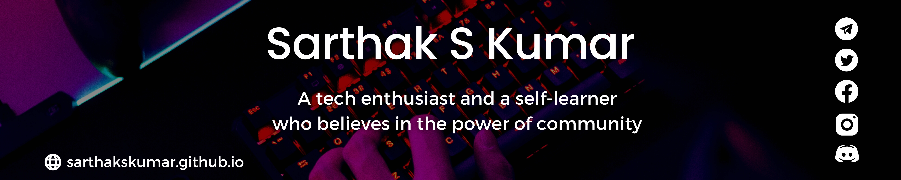

</img>

# Hi, I am <a href = "https://linkedin.com/in/sarthakskumar">Sarthak</a>. Nice to see you here 👋

<b>A 19-year-old, pursuing B.Tech in Computer Science from [PES University, Bangalore](https://www.pes.edu).</b> 
I am a passionate self-learner and an open-source enthusiast. I love exploring and building projects👨‍💻 using various technologies. 
I conduct workshops, events, and collaborative programs in science, innovation, computers, entrepreneurship, etc.

- 🔭 Check out my <a href="https://sarthakskumar.github.io">portfolio website</a>
- 🌱 I look for opportunities to use my skills to solve challenging real-world problems.
- 🪶 I try to offer my contribution which realises the power of community.
- 👯 I am open for collaboration with creators, developers and tech enthusiasts.
- 🚢 Keen on developing my skill set and putting it to use.  

## 📩 Connect with me
Don't hesitate to ping me🤝. If you are interested to discuss any further, I'm always open for a conversation!!✔  
Shoot me an email <a href = "mailto:sskworld9742@gmail.com">here</a> for official discussions.  

 
 
 
 
 
 

## ⚡ Languages, Tools and Technologies

 
 
 
 
 
 
 
 
 
 
 
 
 
 
 
 
 
 
 
 
 
 
 
 
 
 

## 📊 Coding Stats

<b><h3>📉Github Stats</h3></b>

 
<b><h3>🏆Trophies</h3>

 
<b><h3>📈Wakatime Stats</h3>

 
 Time coded since April 2022 <a href="https://wakatime.com/@b17387c5-a507-422c-9357-f0ea781c2266"> </a>
 
<b><h3>✒️Recent GitHub Activity</h3>
  
<!--START_SECTION:activity-->
1. ❗️ Opened issue [#9](https://github.com/SarthakSKumar/Arduino-Projects-and-Scripts/issues/9) in [SarthakSKumar/Arduino-Projects-and-Scripts](https://github.com/SarthakSKumar/Arduino-Projects-and-Scripts)
2. 🗣 Commented on [#8](https://github.com/SarthakSKumar/Arduino-Projects-and-Scripts/issues/8) in [SarthakSKumar/Arduino-Projects-and-Scripts](https://github.com/SarthakSKumar/Arduino-Projects-and-Scripts)
3. 🗣 Commented on [#7](https://github.com/SarthakSKumar/Arduino-Projects-and-Scripts/issues/7) in [SarthakSKumar/Arduino-Projects-and-Scripts](https://github.com/SarthakSKumar/Arduino-Projects-and-Scripts)
4. ❗️ Opened issue [#7](https://github.com/SarthakSKumar/Arduino-Projects-and-Scripts/issues/7) in [SarthakSKumar/Arduino-Projects-and-Scripts](https://github.com/SarthakSKumar/Arduino-Projects-and-Scripts)
5. 💪 Opened PR [#57](https://github.com/acmpesuecc/Slide/pull/57) in [acmpesuecc/Slide](https://github.com/acmpesuecc/Slide)
<!--END_SECTION:activity-->
  </b>

 
 **Visitors Count**  

 
### Show some ❤️ by starring 🌟 some of my repos!

