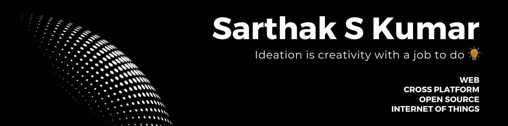

<!---
Please consider starring the repo if you find this useful in any manner
or use it. It helps me a lot.
-->
</img>
# Hi, I am <a href = "https://linkedin.com/in/sarthakskumar">Sarthak</a>. Nice to see you here 👋
<b>A 20-year-old, pursuing B.Tech in Computer Science from [PES University](https://www.pes.edu)</b> 
I am a passionate self-learner and an open-source enthusiast. I love exploring and building projects👨‍💻 using various technologies. 
I conduct workshops, events, and collaborative programs in science, innovation, computers, entrepreneurship, etc.

- 🔭 Check out my <a href="https://sarthakskumar.github.io"><b>Portfolio Website</b></a>
- 🌱 I look for opportunities to use my skills to solve challenging real-world problems.
- 🪶 I try to offer my contribution which realises the power of community.
- 👯 I am open to collaboration with creators, developers and tech enthusiasts.
- 🚢 Keen on developing my skill set and putting it to use. 

## 📩 Connect with me
Don't hesitate to ping me🤝. If you are interested to discuss any further, I'm always open for a conversation!!✔ Shoot me an email <a href = "mailto:sskworld9742@gmail.com"><b>here</b>  

	

## ⚡ Languages, Tools and Technologies
	
<table>
<tr>
	<td><strong>Frontend & Design</strong></td>
	<td><strong>DevOps & Deployment</strong></td>
	<td><strong>Version Control</strong></td>
	<td><strong>Editors</strong></td>
</tr>
<tr>
	<td></td>
	<td></td>
	<td></td>
	<td></td>
</tr>
</table>
<table>
<tr>
	<td><strong>Backend & Databases</strong></td>
	<td><strong>API & Testing</strong></td>
	<td><strong>Languages</strong></td>
	<td><strong>Miscellaneous</strong></td>
</tr>
<tr>
	<td></td>
	<td></td>
	<td></td>
	<td></td>
</tr>
</table>

## 📊 Metrics
<table>
	<tr>
		<td colspan = "2"></td>
	</tr>
	<tr>
		<td></td>
		<td></td>
	</tr>
	<tr>
		<td colspan = "2"></td>
	</tr>
	<tr>
		<td>			</td>
		<td>			</td>
	</tr>
	</table>

<h2>✒️ Recent GitHub Activity</h1>

	
<!--START_SECTION:activity-->
1. 🎉 Merged PR [#52](https://github.com/SarthakSKumar/Next.js-13-PESU_IO-2023/pull/52) in [SarthakSKumar/Next.js-13-PESU_IO-2023](https://github.com/SarthakSKumar/Next.js-13-PESU_IO-2023)
2. 🎉 Merged PR [#51](https://github.com/SarthakSKumar/Next.js-13-PESU_IO-2023/pull/51) in [SarthakSKumar/Next.js-13-PESU_IO-2023](https://github.com/SarthakSKumar/Next.js-13-PESU_IO-2023)
3. 🎉 Merged PR [#37](https://github.com/SarthakSKumar/Next.js-13-PESU_IO-2023/pull/37) in [SarthakSKumar/Next.js-13-PESU_IO-2023](https://github.com/SarthakSKumar/Next.js-13-PESU_IO-2023)
4. 🎉 Merged PR [#50](https://github.com/SarthakSKumar/Next.js-13-PESU_IO-2023/pull/50) in [SarthakSKumar/Next.js-13-PESU_IO-2023](https://github.com/SarthakSKumar/Next.js-13-PESU_IO-2023)
5. ❌ Closed PR [#2](https://github.com/SarthakSKumar/Next.js-13-PESU_IO-2023/pull/2) in [SarthakSKumar/Next.js-13-PESU_IO-2023](https://github.com/SarthakSKumar/Next.js-13-PESU_IO-2023)
<!--END_SECTION:activity-->
  </b>

<h2>📝 Testimonials and Recommendations</h2>

<table>
	<tr align="center">
		<td><b>Name</b></td>
		<td><b>Thoughts</b></td>
		<td><b>Designation/Activity</b></td>
	</tr>
	<tr>
		<td><a href="https://www.linkedin.com/in/bilal-meccai-a3b6a7168"><b>Bilal Meccai</b></a></td>
		<td>Sarthak is a very determined individual who is very knowledgeable In his domain of programming. I got the opportunity to learn Python programming hosted by Sarthak and his team ( fusion) where I got to experience basics to advance levels of Python programming. Sarthak is also a Keen learner and can give guidance when it comes to Web development. A robust personality. Would highly recommend Sarthak.</td>
		<td>DevOps Engineer | Information System Administration</td>
	</tr>
	<tr>
		<td><a href="https://www.linkedin.com/in/vikram-sujive"><b>Vikram Sujive</b></a></td>
		<td>Sarthak has helped design several promotional materials and creative assets for our college club, Shunya and its events of various scales. As the former Head of Design of the club, I have had the pleasure of working closely with Sarthak on several occasions, and his creativity, attention to detail, and professionalism have always made him one of the leading designers/ club members.

Sarthak has an exceptional ability to take whatever resources and turn them into visually stunning designs. He has consistently delivered high-quality work, often exceeding our expectations, and has always been willing to go the extra mile to ensure that we are satisfied with the final product. There have been occasions where he has learnt the basics of software in order to get a design done in a specific manner. He is also very open to suggestions/ feedback and is very trustworthy.</td>
		<td>Transportation Mobility Systems Engineer</td>
	</tr>
	<tr>
		<td><a href="https://www.linkedin.com/in/ritika-chauhan-687055208"><b>Ritika Chauhan</b></a></td>
		<td>Sarthak joined CS Mock as a campus manager, and he outshone from day one. His dedication towards work and work ethic are commendable. 
He was very proactive and a great team player throughout his internship. 
He always gave suggestions in ways the work culture can be improved for the company and to become more accommodating for all.
I will be more than happy to recommend Sarthak if you are looking for someone with enduring dedication towards his work.</td>
		<td>HR Executive</td>
	</tr>
	<tr>
		<td><a href="https://www.linkedin.com/in/rajath-01b605213"><b>Rajath Kumar J</b></a></td>
		<td>If anyone is looking for a creative-minded programmer then you must take a look at Sarthak's profile. My work experience with Sarthak was filled with the right guidance and satisfaction. A mentor, coder and a person with a golden heart</td>
		<td>Digital Marketing, Copywriting</td>
	</tr>
	<tr>
		<td><a href="https://www.linkedin.com/in/sherone-d-souza-9a497b180"><b>Sherone D'Souza</b></a></td>
		<td>Talented yet creative, Sarthak is an out-of-the-box thinker and a great leader. He is indeed a pleasure to work with.
Besides having a great sense of humor he is a systematic organizer and an innovative programmer.
If you're looking for anyone to spice up your experience, Sarthak is who I would recommend.</td>
		<td>CSE Student, MIT Manipal</td>
	</tr>
</table>

<h3><b>Visits Count 👁️</b></h3>

 
### Show some ❤️ by starring 🌟 some of my repos!

